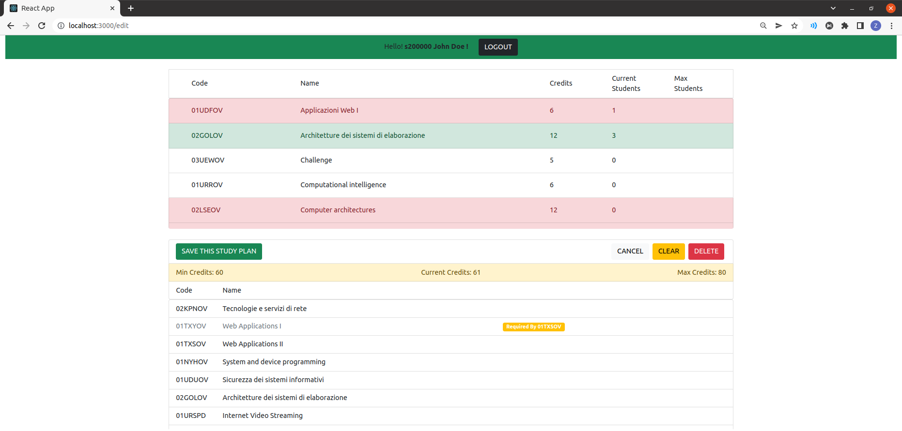

# Exam #1: "StudyPlan"

## Student: s301120 ZHAO LONGSHENG

## React Client Application Routes

- Route `/`: Unauthenticated Homepage.
  - Shows the complete available course list.
- Route `/edit`: Editing Route
  - Once authenticated, the user will be redirected to this route to create/edit study plan.

## API Server

### GET

- `/api/courses/`
  - Request: _None_
  - Respond:
    - body: complete available course list.

- `/api/course/:code`
  - Request:
    - params:
      - code: the code of requesting course
  - Respond:
    - body:
      - the course described by the code

- `/api/studyPlans/:matricola`
  - Request:
    - params:
      - matricola: the student number(with initial s) of the requesting student
  - Respond:
    - body:
      - the list of selected courses belonging to the student

- `/api/sessions/current`
  - Request: _None_
  - Respond:
    - If authenticated, the current session maintained by express-session.js
    - If failed, an error message

### POST

- `/api/studyPlans/:matricola`
  - Request:
    - params:
      - matricola: the student number(with initial s) of the requesting student
    - body:
      - The object with the study plan and the boolean value indicating the list being full time or not
  - Respond:
    - body:
      - the list of selected courses belonging to the student

- `/api/sessions/current`
  - Request:
    - Credentials: the user's information for authentication
  - Respond:
    - If authenticated, an user session
    - If failed, an error message
  
### PUT

- `/api/studyPlans/:matricola`
  - Update the study plan (including "deleting")
  - Request:
    - params:
      - matricola: the student number(with initial s) of the requesting student
    - body:
      - The object with the study plan and the boolean value indicating the list being full time or not
  - Respond:
    - body:
      - If updating successfully, a status 201 without any message
      - If not found, a status 404
      - If failed, a 503 with a json message of the reason

- `/api/courses/book/:code`
  - Booking a course
  - Request:
    - params:
      - code: The course code of the requesting course
  - Respond:
    - If successful, status 200 without message
    - If failed
      - Status 404 for no courses found
      - Status 503 for general errors

- `/api/courses/unBook/:code`
  - Un-booking a course
  - Request:
    - params:
      - code: The course code of the requesting course
  - Respond:
    - If successful, status 200 without message
    - If failed
      - Status 404 for no courses found
      - Status 503 for general errors

### DELETE

- `/api/studyPlans/:matricola`
  - Request:
    - params:
      - matricola: the student number(with initial s) of the requesting student
  - Respond:
    - Status 204 on success
    - Status 404 on entries not found
    - Status 500 otherwise

- `/api/sessions/current`
- Remove current session of user(log out)
  - Request: _None_
  - Respond: _None_

## Database Tables

- Table `Courses` - contains all the necessary information about any course available
- Table `Study_Plans` - contains all defined/undefined study plans (assuming pre-defined along with the user)
- Table `Users` - containing all the user information

## Main React Components

```text
 /
├── AuthNavBar: The navigator bar that provides login/logout functionalities.
├── AvailableCoursesList: The list for all available courses to be selected
│   ├── ListRow: The static row that display basic information for courses
│   └── ListRowStatus: The interactive row that displays additional information
└── /edit
    └── SelectedCoursesList: The list for user-selected courses
        ├── CreateNewStudyPlanRow: Providing options about Full time when creating
        ├── ListCredits: The row that displays current credits
        ├── ListActions: Providing table functions for the list, like save or delete
        └── ListContent: The row that displays information of selected course
```

## Screenshot



## Users Credentials

### Part-Time

- s100000, password
- s300000, password
- s500000, password

### Full-Time

- s200000, password
- s400000, password
